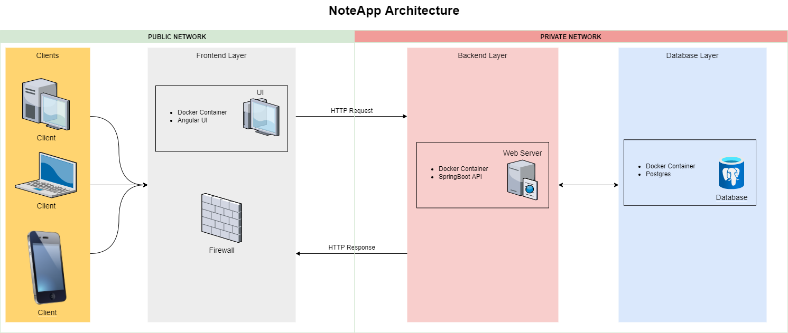
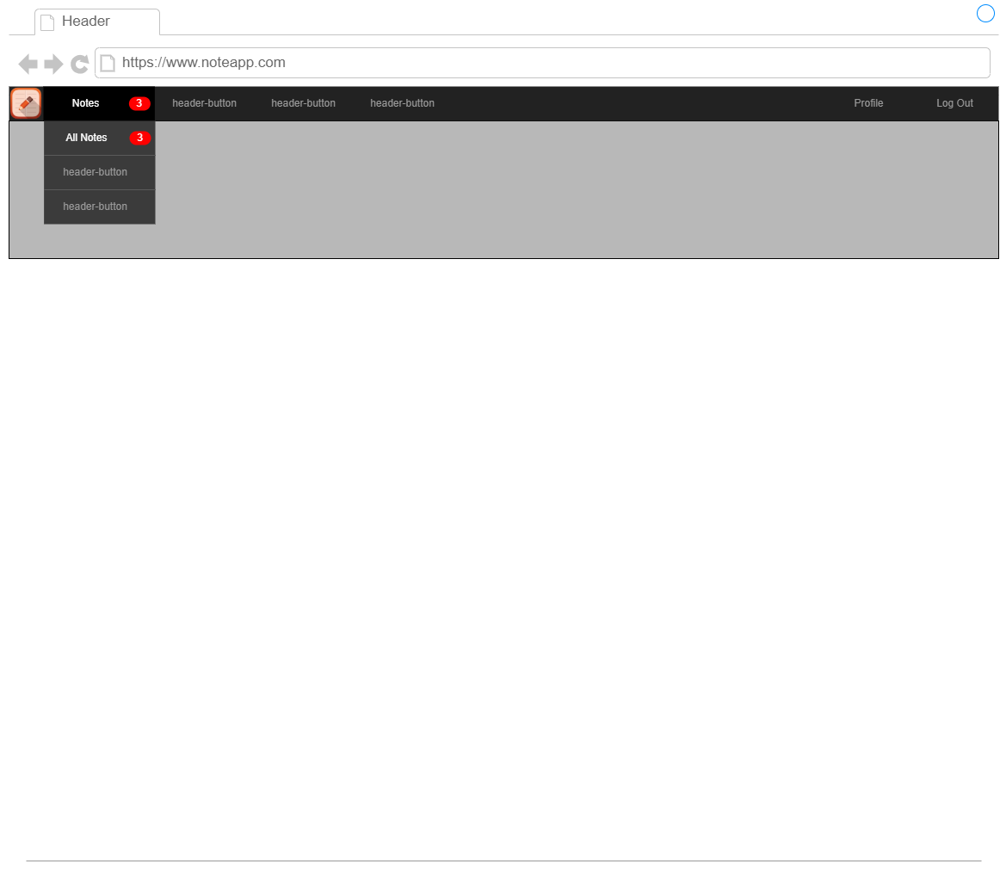
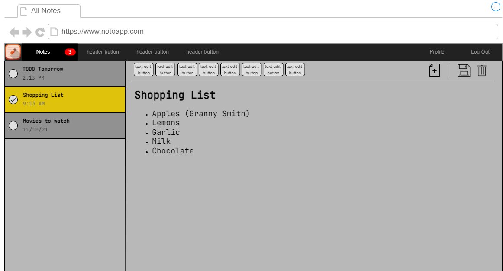

# Note App Design

### 1. Describe high level design

> Show the main note app components and the logical interactions that will fulfill the requirements.



### 2. Web App UI

> Provide a wireframe design of the note web app that will fulfill the requirements.




### 3. Data Model

> Describe how a note will be modelled. Consider the required properties.

```java
// Access modifiers, getters, setters, etc.: omitted for readability
class Note {
	Long id;
	Long userId;
	String textBody;
	LocalDateTime creationDate;
	LocalDateTime lastModifiedDate;
	Boolean isDeleted;
}
```

### 4. Restful API

> Describe the Restful API required to fulfill the note app.

- **_How would the web app get the user’s notes?_**
    - The web application is going to send a `HTTP GET` request to the backend.
        - The request is going to have the user's `JWT` token attached as a header or a cookie.
    - The backend is going to read the request as well as the user's id from the `JWT` token.
    - The backend is going to fetch all user the notes by `userId` sorted by `lastModifiedDate` from the database.
    - The backend is going to return them in the body of a `HTTP Response` with status code 200.
    - The frontend should receive the response and be able to display the notes to the user.


- **_How would the web app save a user note?_**
    - The web application is going to send a `HTTP POST` request to the backend.
        - The request is going to have the user's `JWT` token attached as a header or a cookie.
        - The request is going to have the `NoteDto Json` object attached in the body.
    - The backend is going to read the request as well as the user's id from the `JWT` token.
    - The backend is going to create the note with specifying `note.setId({userId})` (`userId` is stored in the `JWT`) in the
      database.
    - The backend is going to return the newly created note in the body of a `HTTP Response` with status code 201.
    - The frontend should receive the response and be able to show the updated user's notes.


- **_What are the URL for the note resource(s)? What are the verbs to expose the actions?_**
    - `GET /notes/get-all-for-user` - to fetch all user notes
    - `POST /notes/create-new-note` - to create a new note for the user
    - `DELETE /notes/delete-by-id/{note-id}` - to delete a note for the user

### 5. Web Server

> Describe how the webserver implements that Restful API:

- **_Consider how each action will be implemented._**
    - Get all notes:
      ```java
      @GetMapping("/notes/get-all-for-user")
      public ResponseEntity<List<NoteDto>> getAllUserNotes(final HttpServletRequest request) {
          final var userId = getUserId(request.getCookies());
          return status(CREATED).body(noteService.getAllUserNotes(userId));
      }
      ```

    - Create new note:
      ```java
      @PostMapping("/notes/create-new-note")
      public ResponseEntity<Object> createNote(@RequestBody @Valid final NoteDto noteDto,
                                               final HttpServletRequest request) {
          final var userId = getUserId(request.getCookies());
          return status(CREATED).body(noteService.createNote(userId, noteDto));
      }
      ```

    - Delete note:
      ```java
      @DeleteMapping("/notes/delete-by-id/{note-id}")
      public ResponseEntity<Object> deleteNote(@PathVariable("note-id") @NotNull final Long noteId,
                                               final HttpServletRequest request) {
          final var userId = getUserId(request.getCookies());
          noteService.deleteNote(userId, noteId);
          return status(OK).build();
      }
      ```


- **_What (if any) business logic is required?_**
    - One example could be that the text body of the `noteDto` object must not be blank or greater than 5000 characters:
      ```java
      // Access modifiers, getters, setters, etc.: omitted for readability
      class NoteDto {
          // ...

          @NotBlank
          @Size(max = 5000)
          String textBody;
      
          // ...
      }
      ```

    - Another crucial example would be that a user must not be able to delete another user's notes in any way:
      ```java
      // Access modifiers, autowiring, etc.: omitted for readability
      @Service
      class NoteServiceImpl implements NoteService {
          // ...

          @Override
          // The userId method parameter is going to be filled with the userId from the JWT
          public void deleteNote(final Long userId, final Long noteId) {
              final var note = noteRepository.getById(noteId);
              if (userId != note.getUserId) {
                  throw new ResponseStatusException(HttpStatus.FORBIDDEN);
              }
              brandRepository.deleteById(id);
          }
      
          // ...
      }
      ```


- **_How are the notes saved?_**
    - When a `NoteDto` object comes to the controller method `createNote(...)`, first it is validated if it is as expected.
        - If not, then `HTTP Status 400: Bad Request` is going to be returned.

    - Afterwards, the object is sent to the `NoteService` class together with the userId from the `JWT`.
        - First, the `NoteDto` object is mapped to a `Note` object with the note `userId` field equal to the userId from
          the `JWT`.
        - Then, the `noteRepository.save(note)` method is invoked so that the note repository can send a request to the database
          to create the note and the result of the method is mapped to a `NoteDto` object.
        - Lastly, the resulting `NoteDto` object is returned.

    - The controller method returns the `NoteDto` object in the body of the response with `HTTP Status Code 201: Created`
      towards the client (our frontend).
